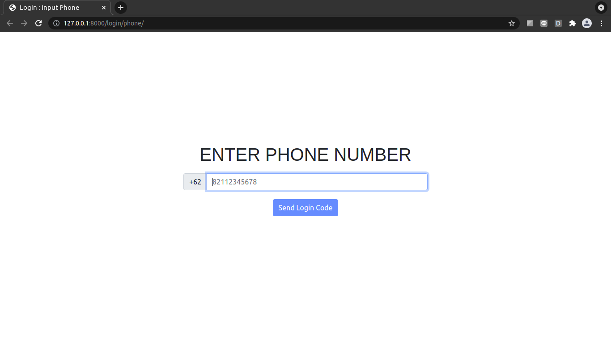
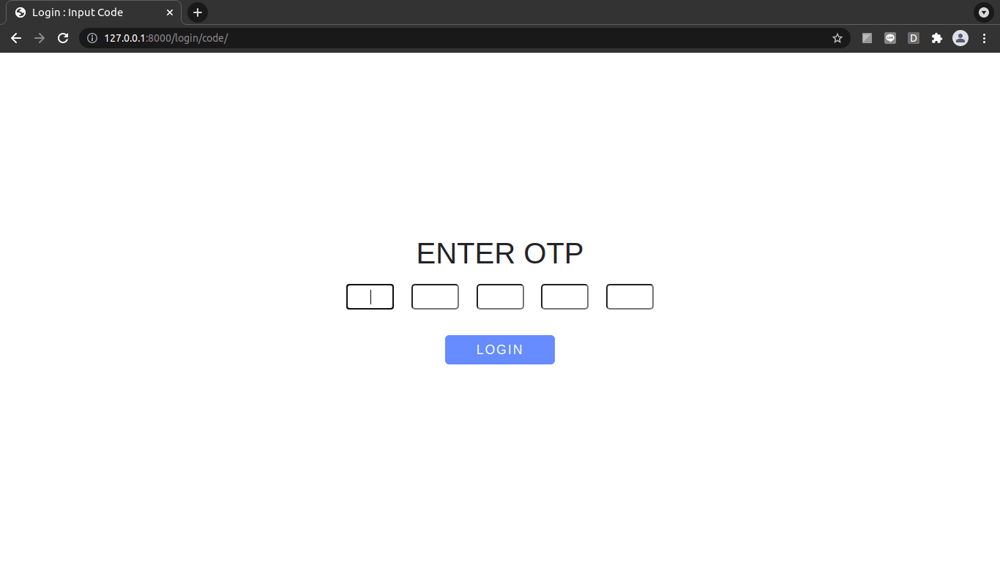
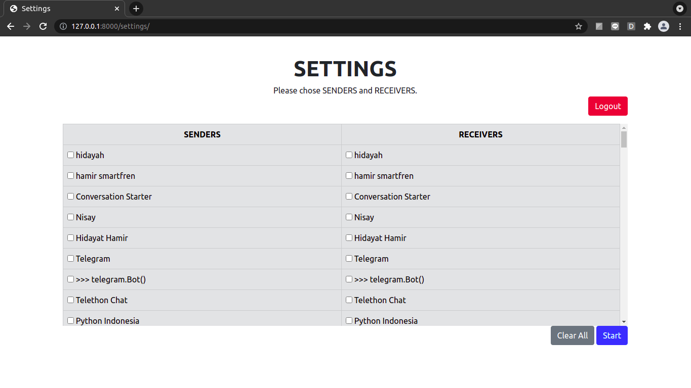
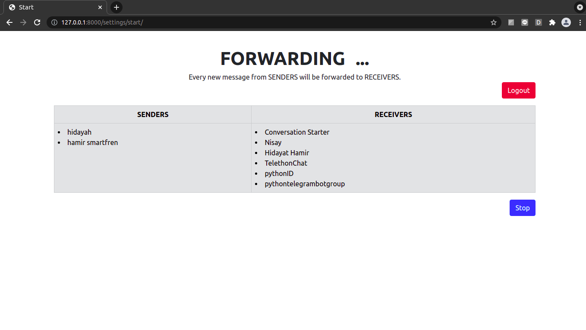

# forward-telegram-chat-web
With this project, you can access telegram user then forward message from `A,B,C,D,E` to `F,G,H,I,J`.

## How to run this project
1. Download then open the project folder, and install requirement.
```
pip3 install -r requirements.txt
```

2. Open my.telegram.org to get your API_ID and API_HASH then use it in `environ.yaml`

3. Run project.
```
python3 main.py
```


4. Open that link.


5. Input your phone number. then click `send login code`. Telegram will sent login code to your telegram account.


6. Input your login code, then click `login`.


7. Chose senders and receivers. then click `start`.
